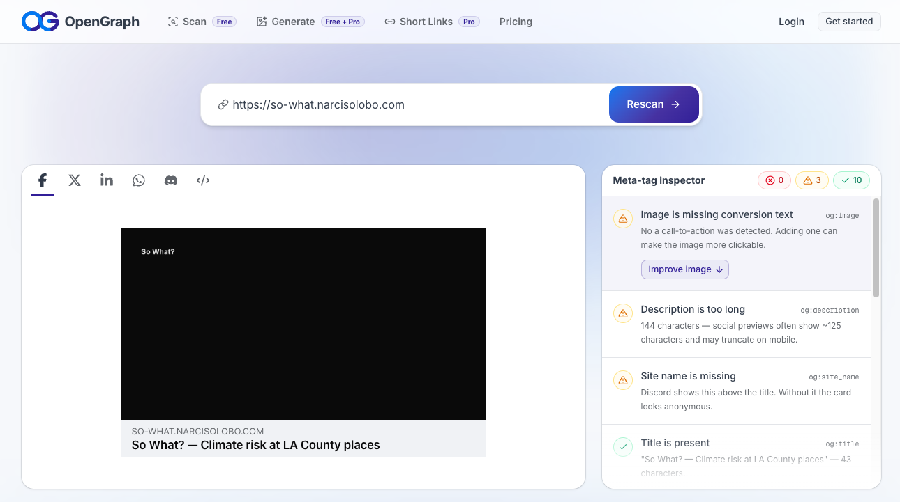

# M0 deployment spike: findings

Spec: [§8.3](../specs/2026-09-27-so-what-design.md). Plan: [M0 plan](../plans/2026-09-28-m0-deployment-spike.md).

## Versions

| Package                         | Version    |
| ------------------------------- | ---------- |
| next                            | 16.3.6     |
| drizzle-orm / drizzle-kit       | 1.0.0-rc.4 |
| @tursodatabase/serverless       | 1.4.0      |
| @tursodatabase/database (tests) | 0.7.2      |
| vitest                          | 5.0.2      |
| turso CLI                       | v1.0.32    |

## Choices

- **Local test driver:** `drizzle-orm/tursodatabase/database` over `@tursodatabase/database`, opened with `await connect(':memory:')`. (The spec's `drizzle-orm/tursodatabase-database` path doesn't exist.)
- **Generated schema path:** `web/src/lib/db/generated/schema.ts` (the spec says `web/lib/db/schema.ts`).

## drizzle-kit pull quirks

- Writes `schema.ts`, `relations.ts` and a migration folder; the folder is gitignored.
- Inline CHECK constraints next to `--` comments, or spanning lines, come out garbled in `check(...)`. Harmless: no migrations.

## Turso

- **Location:** group `sowhat`, `aws-us-west-2` (Oregon) → Vercel `pdx1`, URL: `libsql://sowhat-m0-narcisoignacio.aws-us-west-2.turso.io`.
- **Read-only token:** reads work (`row_count_places` = `"6"`), writes are rejected with `BLOCKED`.
- **`drizzle-kit pull` against Turso Cloud:** no diff to `schema.ts` or `relations.ts`. `drizzle.config.ts` falls back to the local file when `TURSO_DATABASE_URL` is unset, and drizzle-kit doesn't read `.env.local`, so export the variables first. The pull logs `0 check constraints fetched`, but all 10 CHECKs are in `schema.ts`.
- **App locally against Turso Cloud:** the `libsql://` URL works as-is, no `https://` needed. `/api/health` → `{"ok":true,"places":6}`; `/api/spike/viewport` → `count` 4. From LA to `aws-us-west-2`, `queryMs` was 1159 and 738 on cold connections and about 105 once warm (2026-09-29). These times aren't the real latency test, which runs from Vercel in Task 6.

Raw output:

```bash
curl -s "$HTTP_URL/v2/pipeline" -H "Authorization: Bearer $TURSO_AUTH_TOKEN" -H 'Content-Type: application/json' \
  -d '{"requests":[{"type":"execute","stmt":{"sql":"SELECT value FROM meta WHERE key = '\''row_count_places'\''"}},{"type":"close"}]}'
{"baton":null,"base_url":null,"results":[{"type":"ok","response":{"type":"execute","result":{"cols":[{"name":"value","decltype":"TEXT"}],"rows":[[{"type":"text","value":"6"}]],"affected_row_count":0,"last_insert_rowid":null,"replication_index":null,"rows_read":1,"rows_written":0,"query_duration_ms":137.578}}},{"type":"ok","response":{"type":"close"}}]}
```

```bash
curl -s "$HTTP_URL/v2/pipeline" -H "Authorization: Bearer $TURSO_AUTH_TOKEN" -H 'Content-Type: application/json' \
  -d '{"requests":[{"type":"execute","stmt":{"sql":"DELETE FROM meta"}},{"type":"close"}]}'
{"baton":null,"base_url":null,"results":[{"type":"error","error":{"message":"Operation was blocked: SQL write operations are forbidden (current session doesn't have write permission)","code":"BLOCKED"}},{"type":"ok","response":{"type":"close"}}]}
```


## Vercel

- Domain and CNAME set up before M0. CAA: none on the root domain. Certificate valid.

- Region shows as `pdx1`.
   Raw output:

  ```bash
  curl -s "https://$SITE_HOST/api/spike/viewport"
  {"queryMs":63,"count":4,"region":"pdx1"}
  ```

- Preview checker shows the image.
   

- Project root: `web`. `ENABLE_EXPERIMENTAL_COREPACK=1`: not needed.


## Latency

Measured 2026-09-29, 20 samples after 2 warm-up calls, Function in `pdx1`, DB in `aws-us-west-2`.

| Metric                          | Median | Max    |
| ------------------------------- | ------ | ------ |
| `queryMs` (inside the Function) | 12 ms  | 999 ms |
| `time_total` (from LA)          | 0.50 s | 1.45 s |

- 16 of 20 `queryMs` samples were 10–20 ms. The 744 and 999 ms outliers are most likely cold Function instances opening a new Turso connection. The two warm-up calls only warm one instance.
- `time_total` is dominated by the network between my machine and Vercel, not by the query.


## Tile provider

| Requirement (spec)                                                                                     | MapTiler | Stadia | CARTO |
| ------------------------------------------------------------------------------------------------------ | -------- | ------ | ----- |
| Free tier allows non-commercial public use (§8.1)                                                      | ✅        | ✅      | ✅     |
| Monthly free allowance vs demo traffic                                                                 | ❌        | ✅      | ❌     |
| Key or auth can be restricted to `$SITE_HOST`, `*-<vercel-team>.vercel.app` and `localhost` (§7.4, §9) | ⚠️        | ⚠️      | ⚠️     |
| Raster XYZ tiles usable from Leaflet                                                                   | ✅        | ✅      | ✅     |
| Light and dark styles for pin contrast checks (§11)                                                    | ✅        | ✅      | ✅     |
| Required attribution text                                                                              | ✅        | ✅      | ✅     |

1. Free tier allows non-commercial public use
   - Stadia Maps: Yes. Their free tier explicitly allows non-commercial, public-facing applications (such as academic, testing, and demonstration use).
   - MapTiler: Yes. Their Free plan supports personal or non-commercial public use.
   - CARTO: Yes. Their Basemaps free tier allows non-commercial public deployments up to 5 million requests per month.
2. Monthly free allowance vs. demo traffic
   - Stadia Maps: Yes. It gives a fixed pool of 200,000 monthly credits with zero credit card required. Overages are blocked by default (returning HTTP 429), eliminating any risk of surprise bills from demo traffic or unexpected site spikes.
   - MapTiler: No. Their Free plan is tied strictly to a "session" or transaction count (5,000 sessions/month). Exceeding it will automatically prompt you to move to their paid $30/month Flex tier or block requests based on pricing structural limits.
   - CARTO: No. While the allowance is generous (5M requests), CARTO acts as a broad-scale infrastructure; managing sudden spikes or setting customized hard-stops on the standalone free API key can be less flexible compared to dedicated credit pool dashboards.
3. Key or auth restriction ($SITE_HOST, *-<vercel-team>.vercel.app, and localhost)
   - Stadia Maps: Partial (corrected in Step 2). [Domain-based auth](https://docs.stadiamaps.com/authentication/#domain-based-authentication) covers `$SITE_HOST` with no key, and `localhost`/`127.0.0.1` need no auth. But the dashboard allowed only one domain, so the `*.vercel.app` preview pattern couldn't be added. API keys can't be domain-restricted at all.
   - MapTiler: Partial. They allow domain whitelisting (*.mydomain.com), but coordinating complex, nested multi-wildcard preview patterns (like Vercel's dynamic team/branch combinations) alongside active local environment setups on a single key can sometimes hit rule limitations.
   - CARTO: Partial. They support basic domain/IP restrictions on their standalone keys, but lack granular control for complex cloud-native development workflows (like Vercel preview branch patterns).
4. Raster XYZ tiles usable from Leaflet
   - Stadia Maps: Yes. They serve standard raster PNG tiles fully compatible with standard Leaflet L.tileLayer configurations.
   - MapTiler: Yes. They support XYZ raster tiles out of the box.
   - CARTO: Yes. CARTO Basemaps are natively structured as standard XYZ web raster layers frequently used with Leaflet.
5. Light and dark styles for pin contrast checks
   - Stadia Maps: Yes. They feature native light and dark modes tailored perfectly for accessibility and map feature element contrast testing (such as Alidade Smooth, Alidade Smooth Dark, Stamen Toner, and Stamen Toner Dark).
   - MapTiler: Yes. Offers diverse style schemas including basic Light and Dark variants.
   - CARTO: Yes. Provides the iconic Positron (Light) and Dark Matter (Dark) map variants.
6. Required attribution text
   - Stadia Maps: Yes. Requires standard, copy-pasteable attribution text pointing to Stadia Maps, OpenStreetMap, and Stamen (where applicable).
   - MapTiler: Yes. Requires OpenStreetMap contributors and a MapTiler logo/text badge.
   - CARTO: Yes. Requires visible credit text (© OpenStreetMap contributors, © CARTO).

**Choice: Stadia Maps**, with domain-based auth and no API key.

- Property registered for `$SITE_HOST`. Local dev needs no auth.
- No `NEXT_PUBLIC_TILE_KEY`. A Stadia key can't be domain-restricted, so shipping one to the browser would let anyone spend the quota. Removed from `web/.env.example`, with a comment left in its place.
- **Vercel previews get no base-map tiles.** Only one domain per property, and `*.vercel.app` isn't ours to register. Accepted for M0. Options if previews need a map later: a fixed branch domain like `preview.$SITE_HOST` (if the plan allows a second property), or a server-side tile proxy (costs Function calls and bandwidth).
- **Tile URL templates** (Leaflet, `maxZoom: 20`, from the [Leaflet tutorial](https://docs.stadiamaps.com/tutorials/raster-maps-with-leaflet/)):
  - Light: `https://tiles.stadiamaps.com/tiles/alidade_smooth/{z}/{x}/{y}{r}.png`
  - Dark: `https://tiles.stadiamaps.com/tiles/alidade_smooth_dark/{z}/{x}/{y}{r}.png`
- **Attribution:**

  ```html
  &copy; <a href="https://stadiamaps.com/attribution/" target="_blank">Stadia Maps</a>, &copy; <a href="https://openmaptiles.org/" target="_blank">OpenMapTiles</a> &copy; <a href="https://www.openstreetmap.org/copyright" target="_blank">OpenStreetMap</a>
  ```

**Verification** (2026-09-29, tile `10/175/408`, downtown LA, no `api_key`):

| Referer / Origin                    | Status | `stadia-property` |
| ----------------------------------- | ------ | ----------------- |
| `https://$SITE_HOST`                | 200    | 108154            |
| `https://sowhat-unregistered.invalid` | 401    | none              |
| none                                | 401    | none              |
| `http://localhost:3000` (dark style) | 200    | none checked      |
| `https://example.com`               | 200    | 12196             |

- `108154` is the property Stadia matched for our host. Not cross-checked against the dashboard, which doesn't obviously show the ID.
- `example.com` is registered by another Stadia customer, so it isn't a valid refusal test.
- Domain auth trusts `Referer`/`Origin`, so curl can spoof them. That's Stadia's model, and the free tier blocks overages with `429` rather than billing.